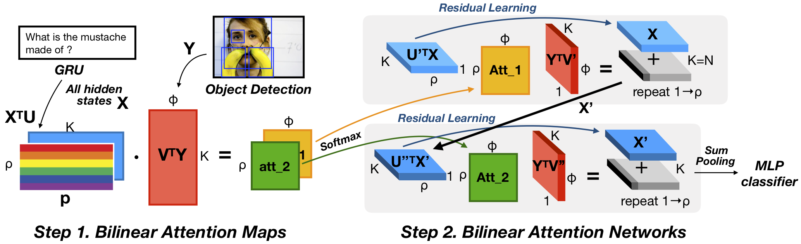

# 双线性注意网络

该存储库是用于视觉问答和 Flickr30k 实体任务的 [Bilinear Attention Networks](http://arxiv.org/abs/1805.07932) 的实现。

对于视觉问答任务，我们的单个模型达到了 **70.35**，15 个模型的集合达到了**71.84**（测试标准，VQA 2.0）。
对于 Flickr30k 实体任务，我们的单一模型在 Recall@1、5 和 10 上分别达到了 **69.88 / 84.39 / 86.40**（略好于原始论文）。
详情请参考我们的【技术报告】（http://arxiv.org/abs/1805.07932）。

这个存储库基于 @hengyuan-hu 的 [work](https://github.com/hengyuan-hu/bottom-up-attention-vqa) 并受到启发。我们衷心感谢他们分享代码。



＃＃＃ 更新

* 使用“torch.einsum”的双线性注意力网络，向后兼容。 ([2019 年 3 月 12 日](https://github.com/jnhwkim/ban-vqa/issues/15#issuecomment-471864594))
* 现在与 PyTorch v1.0.1 兼容。 ([2019 年 3 月 12 日](https://github.com/jnhwkim/ban-vqa/pull/22))

### 先决条件

您可能需要一台具有 4 个 GPU、64GB 内存和适用于 Python 3 的 PyTorch v1.0.1 的机器。

1. 使用 CUDA 和 Python 3.6 安装 [PyTorch](http://pytorch.org/)。
2. 安装 [h5py](http://docs.h5py.org/en/latest/build.html)。

*警告：不要使用 PyTorch v1.0.0，因为 [a bug](https://github.com/pytorch/pytorch/issues/15602) 会导致性能不佳。*

## 质量保证
### 预处理

我们的实现使用来自 [bottom-up-attention](https://github.com/peteanderson80/bottom-up-attention) 的预训练特征，每个图像自适应 10-100 个特征。除此之外，GloVe 向量。为简单起见，以下脚本可帮助您避免麻烦。

所有数据都应下载到此存储库根目录中的“data/”目录中。

下载数据的最简单方法是从存储库根目录运行提供的脚本“tools/download.sh”。如果脚本不起作用，应该很容易检查脚本并根据您的需要修改其中列出的步骤。然后从存储库根目录运行 `tools/process.sh` 以将数据处理为正确的格式。

现在，您应该手动下载以下选项（用于我们最好的单一模型）。

我们使用 Visual Genome 数据集的一部分进行数据扩充。 [图像元数据](https://visualgenome.org/static/data/dataset/image_data.json.zip) 和[问题答案](https://visualgenome.org/static/data/dataset/question_answers.需要将 1.2 版本的 json.zip) 放在 `data/` 中。

我们使用 MS COCO 字幕提取扩展词嵌入的语义连接词以及 VQA 2.0 和 Visual Genome 的问题。你可以在 [这里](http://images.cocodataset.org/annotations/annotations_trainval2017.zip) 下载。由于这些字幕的贡献很小，您可以通过删除此 [line] 中 `target` 选项中的 `cap` 元素来跳过 MS COCO 字幕的处理（https://github.com/jnhwkim/ban-vqa/ blob/master/dataset.py#L393）。

为方便起见，计数模块（[Zhang et al., 2018](https://openreview.net/forum?id=B12Js_yRb)）作为 `counting.py` 集成在此存储库中。源代码库可以在@Cyanogenoid 的 [vqa-counting](https://github.com/Cyanogenoid/vqa-counting) 中找到。

＃＃＃ 训练

```
$ python3 main.py --use_both True --use_vg True
```
开始训练（分别用于训练/验证拆分和视觉基因组训练的选项）。每个 epoch 都会打印训练和验证分数，最好的模型将保存在“saved_models”目录下。默认的超参数应该为您提供单个模型的最佳结果，对于 test-dev 拆分，它约为 **70.04**。

＃＃＃ 验证

如果您使用训练拆分训练模型
```
$ python3 main.py
```
然后您可以使用适当的选项运行“evaluate.py”来评估其验证拆分的分数。

### 预训练模型

我们提供了在论文中报告为最佳单一模型的预训练模型（测试开发为 70.04，测试标准为 70.35）。

请下载 [链接](https://drive.google.com/uc?export=download&id=1OGYxF5WY4uYc_6UobDjhrJIHkl2UGNct) 并移动到 `saved_models/ban/model_epoch12.pth`（您可能会遇到重定向页面来确认）。训练日志位于 [此处](https://drive.google.com/uc?export=download&id=1sEa5bTMOFv_Xjo_A0xeNw379_Sljg9R_)。

```
$ python3 test.py --label mytest
```

结果 json 文件将在目录 `results/` 中找到。

### 没有视觉基因组增强

在没有视觉基因组增强的情况下，我们得到 **69.50**（8 个模型的平均值，标准差为 **0.096**）用于测试开发拆分。我们使用 8-glimpse 模型，学习率从 **0.001** 开始（请参阅此更改以获得更好的结果），13 个 epoch，批量大小为 256。

## Flickr30k 实体
### 预处理
您必须手动将 [Annotation and Sentence](https://github.com/BryanPlummer/flickr30k_entities/blob/master/annotations.zip) 文件下载到 `data/flickr30k/Flickr30kEntities.tar.gz`。然后从这个存储库的根目录运行提供的脚本 `tools/download_flickr.sh` 和 `tools/process_flickr.sh`，类似于 VQA 的情况。请注意，Flickr30k 的图像特征是使用 [bottom-up-attention pretrained model] (https://github.com/peteanderson80/bottom-up-attention.git) 生成的。

＃＃＃ 训练

```
$ python3 main.py --task flickr --out saved_models/flickr
```
开始训练。 `--gamma` 选项不适用。对于测试拆分的 Recall@1，默认超参数应该为您提供大约 **69.6**。


＃＃＃ 验证
请下载[链接](https://drive.google.com/uc?export=download&id=1xiVVRPsbabipyHes25iE0uj2YkdKWv3K) 并移动到`saved_models/flickr/model_epoch5.pth`（您可能会遇到重定向页面来确认）。

```
$ python3 evaluate.py --task flickr --input saved_models/flickr --epoch 5
```
评估测试拆分的分数。


＃＃＃ 故障排除

请查看 [疑难解答 wiki](https://github.com/jnhwkim/ban-vqa/wiki/Troubleshooting) 和 [以前的问题历史记录](https://github.com/jnhwkim/ban-vqa/issues?utf8= ✓&q=是%3Aissue)。

### 引用

如果您将此代码用作任何已发表研究的一部分，如果您能引用以下论文，我们将不胜感激：

```
@inproceedings{Kim2018,
作者 = {Kim, Jin-Hwa and Jun, Jaehyun and Zhang, Byoung-Tak},
booktitle = {神经信息处理系统的进展 31}，
标题 = {{双线性注意网络}}，
页 = {1571--1581}，
年 = {2018}
}
```

＃＃＃ 执照

麻省理工学院许可证